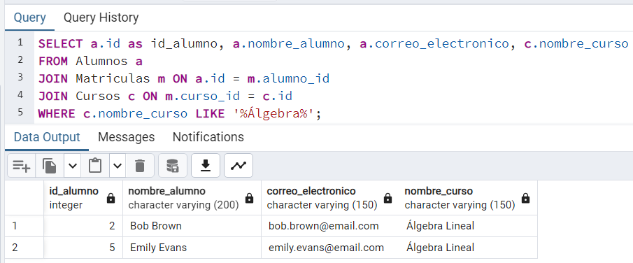
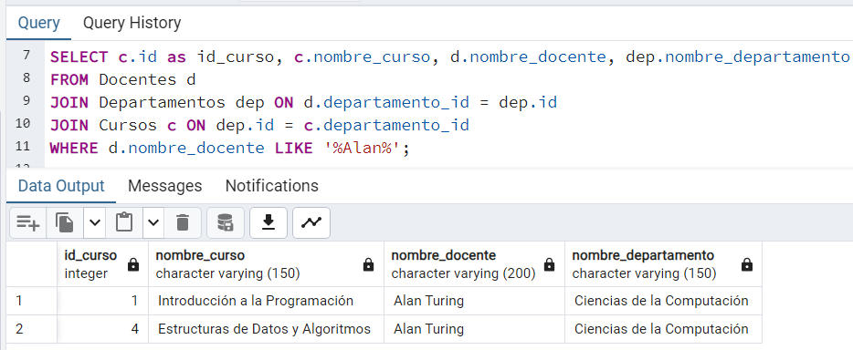
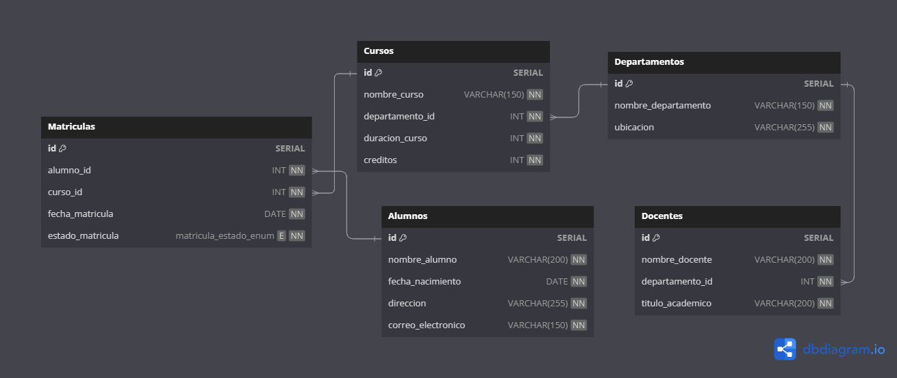

#### Nombres y Apellidos: **Alonso Daniel Quispe Huacho** <br> Dni: **74996916** <br> Celular: **957501458**

## Prueba de Diseño de Base de Datos para Desarrolladores Junior

**Instrucciones**: Diseña una base de datos para un centro educativo que permita llevar un registro de cursos, docentes, departamentos, alumnos y matrículas. Considerar la estructura de las tablas, las relaciones entre ellas y la definición de campos clave. Se puede usar SQL o una herramienta de diseño de bases de datos.

### Parte 1: Definición de Tablas

**1.** Crea una tabla llamada `Cursos` que almacene información sobre los cursos ofrecidos por el centro. Debe incluir los siguientes campos:
- `id` (PK)
- `Nombre del Curso`
- `Departamento_ID` (FK para relacionar con la tabla Departamentos)
- `Duración del Curso`
- `Créditos`

  ```sql
  CREATE TABLE Cursos (
    ID SERIAL PRIMARY KEY,
    nombre_curso VARCHAR(150) NOT NULL,
    departamento_id INT NOT NULL,
    duracion_curso INT NOT NULL,
    creditos INT NOT NULL
  );
  ```

**2.** Crea una tabla llamada `Docentes` que almacene información sobre los docentes. Debe incluir los siguientes campos:
- `ID` (PK)
- `Nombre del Docente`
- `Departamento_ID` (FK para relacionar con la tabla Departamentos)
- `Título Académico`

  ```sql
  CREATE TABLE Docentes (
	  id SERIAL PRIMARY KEY,
  	nombre_docente VARCHAR(200) NOT NULL,
  	departamento_id INT NOT NULL,
  	titulo_academico VARCHAR(200) NOT NULL
  );
  ```

**3.** Crea una tabla llamada `Departamentos` que registre la información de los departamentos académicos del centro. Debe incluir los siguientes campos:
- `ID` (PK)
- `Nombre del Departamento`
- `Ubicación`

  ```sql
  CREATE TABLE Departamentos (
	  id SERIAL PRIMARY KEY,
	  nombre_departamento VARCHAR(150) NOT NULL,
	  ubicacion	VARCHAR(255) NOT NULL
  );
  ```

**4.** Crea una tabla llamada `Alumnos` que almacene información sobre los alumnos matriculados. Debe incluir los siguientes campos:
- `ID` (PK)
- `Nombre del Alumno`
- `Fecha de Nacimiento`
- `Dirección`
- `Correo Electrónico`

  ```sql
  CREATE TABLE Alumnos (
  	id SERIAL PRIMARY KEY,
  	nombre_alumno VARCHAR(200) NOT NULL,
  	fecha_nacimiento DATE NOT NULL,
  	direccion VARCHAR(255) NOT NULL,
  	correo_electronico VARCHAR(150) NOT NULL
  );
  ```

**5.** Crea una tabla llamada `Matrículas` que registre las matrículas de los alumnos en cursos. Debe incluir los siguientes campos:
- `ID` (PK)
- `Alumno_ID` (FK para relacionar con la tabla Alumnos)
- `Curso_ID` (FK para relacionar con la tabla Cursos)
- `Fecha de Matrícula`
- `Estado de la Matrícula` (por ejemplo, "Activa" o "Inactiva")

  ```sql
  /* Creacion de ENUM para los estados */
  CREATE TYPE matricula_estado_enum AS ENUM ('Activa', 'Inactiva');
  ```

  ```sql
  CREATE TABLE Matriculas (
	  id SERIAL PRIMARY KEY,
	  alumno_id INT NOT NULL,
	  curso_id INT NOT NULL,
	  fecha_matricula DATE NOT NULL,
      estado_matricula matricula_estado_enum NOT NULL, -- o BOOLEAN NOT NULL
  );
  ```

### Parte 2: Relaciones y Claves

**6.** Establece las relaciones adecuadas entre las tablas. Define las claves primarias y foráneas según corresponda.

  ```sql
  /* Cursos */
  ALTER TABLE Cursos
  ADD CONSTRAINT fk_cursos_departamento_id
  FOREIGN KEY (departamento_id) 
  REFERENCES Departamentos(id)
  ON DELETE CASCADE;

  /* Docentes */
  ALTER TABLE Docentes
  ADD CONSTRAINT fk_docentes_departamento_id
  FOREIGN KEY (departamento_id) 
  REFERENCES Departamentos(id)
  ON DELETE CASCADE;
  ```
**7.** Define restricciones de integridad referencial para garantizar que las relaciones entre las tablas sean coherentes.

  ```sql
  /* Matrículas */
  ALTER TABLE Matriculas
  ADD CONSTRAINT fk_matriculas_alumno_id
FOREIGN KEY (alumno_id) 
  REFERENCES Alumnos(id),
ON DELETE CASCADE;

  ALTER TABLE Matriculas
ADD CONSTRAINT fk_matriculas_curso_id
FOREIGN KEY (curso_id) 
  REFERENCES Cursos(id)
  ON DELETE CASCADE;
  ```
### Parte 3: Consultas SQL

**8.** Escribe una consulta SQL que muestre todos los alumnos matriculados en un curso específico.
  ```sql
  SELECT a.id as id_alumno, a.nombre_alumno, a.correo_electronico, c.nombre_curso
  FROM Alumnos a
  JOIN Matriculas m ON a.id = m.alumno_id
  JOIN Cursos c ON m.curso_id = c.id
  WHERE c.nombre_curso LIKE '%curso específico%'; 
  /* WHERE c.nombre_curso = 'curso específico'; */
  ```
  

**9.** Escribe una consulta SQL que muestre todos los cursos en los que un docente específico está asignado como instructor.
   ```sql
  SELECT c.id as id_curso, c.nombre_curso, d.nombre_docente, dep.nombre_departamento
  FROM Docentes d
  JOIN Departamentos dep ON d.departamento_id = dep.id
  JOIN Cursos c ON dep.id = c.departamento_id
  WHERE d.nombre_docente LIKE '%docente especifico%';
  /* WHERE d.nombre_docente = 'docente especifico'; */
  ```
  

### Parte 4: Diagrama de la Base de Datos
**10.** Utiliza una herramienta de diseño de bases de datos para crear un diagrama ER (Entidad-Relación) que represente la estructura de la base de datos que has diseñado.

  
